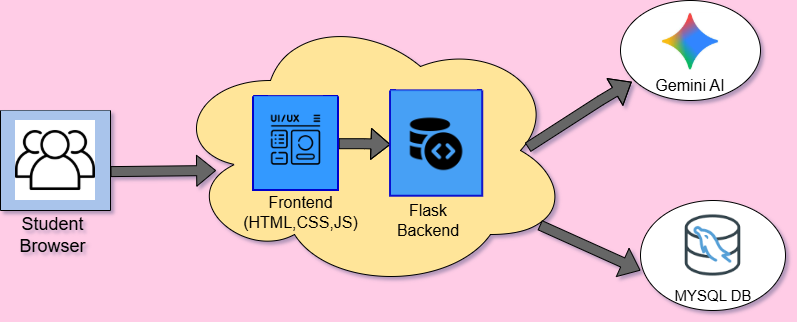
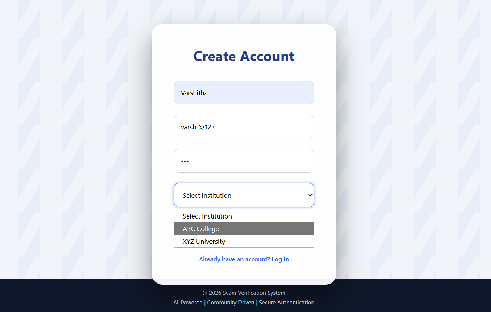
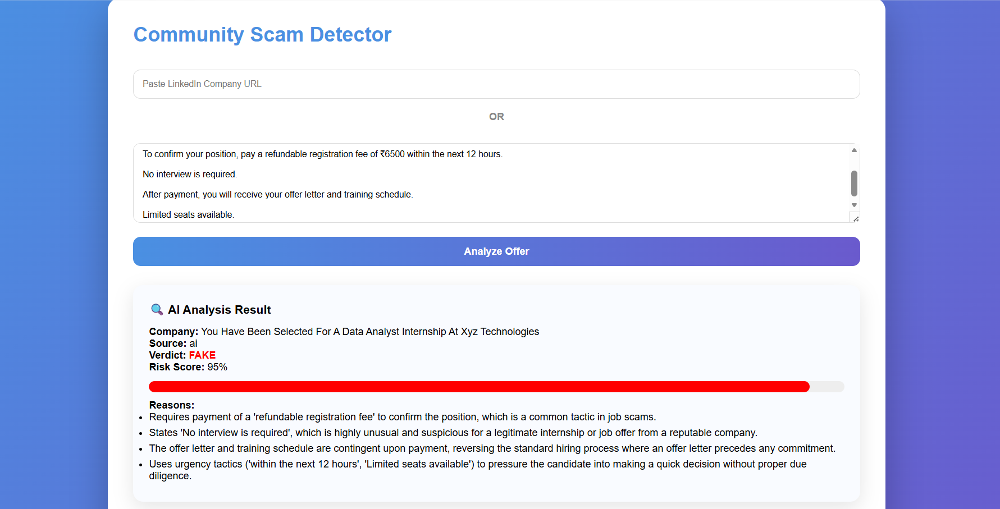
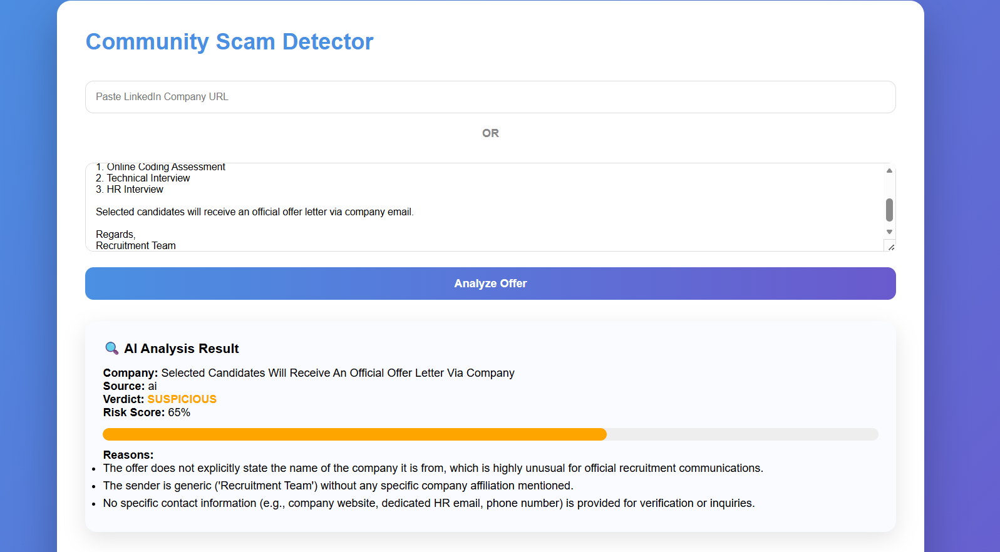
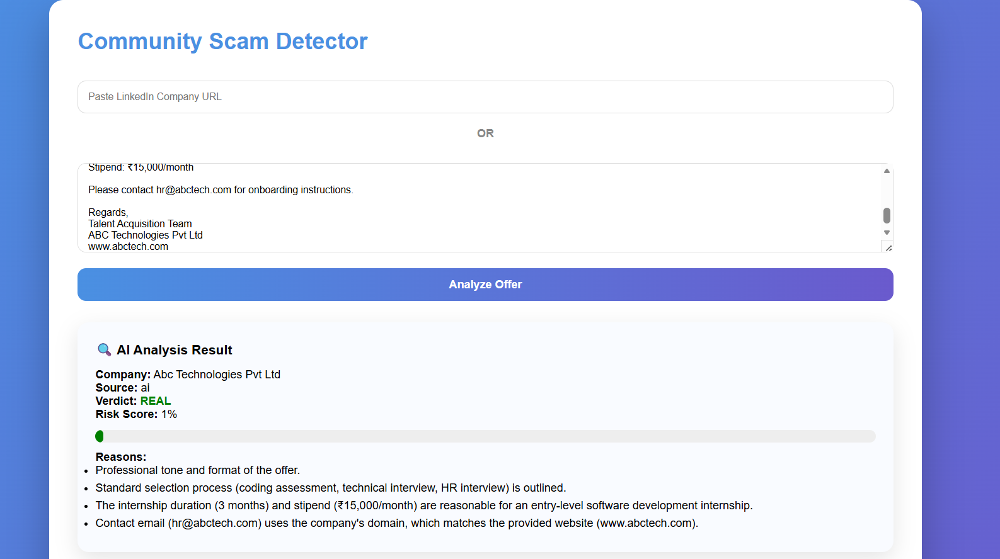
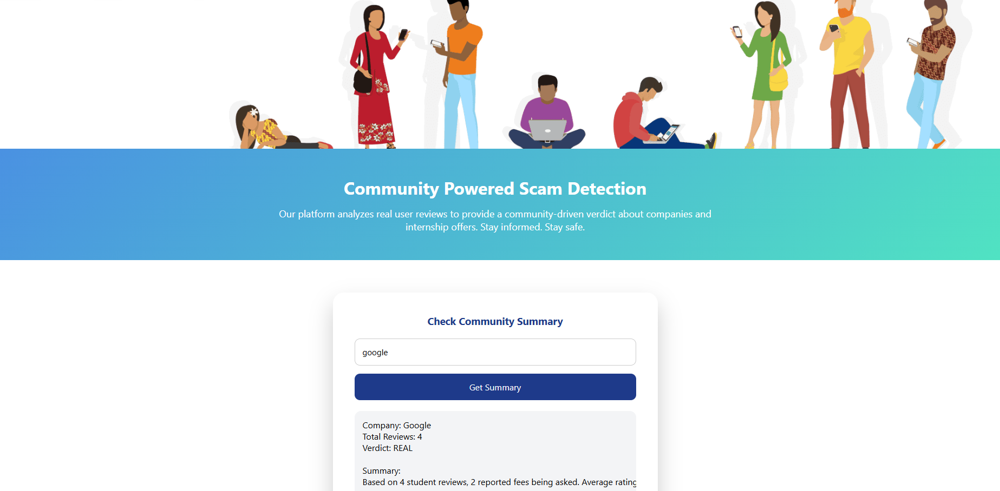
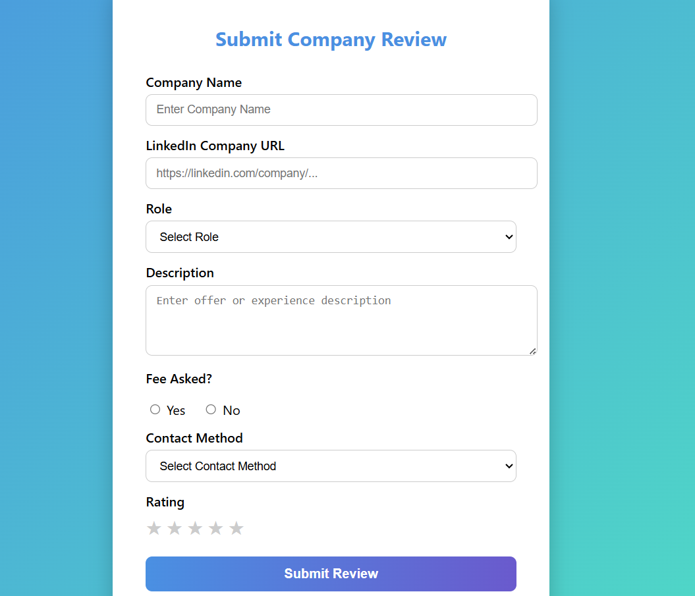
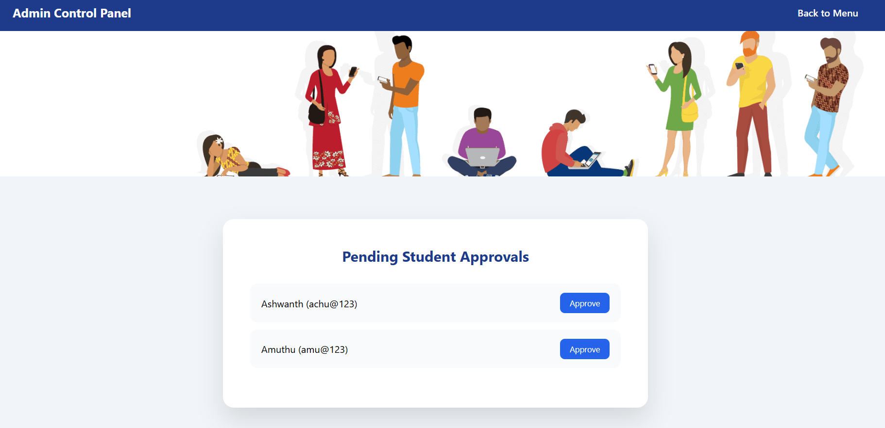

# AI Scam Detection System

## Overview

AI Scam Detection System is a web-based platform that helps students identify fraudulent internship and job opportunities. The platform combines AI-powered analysis using Google's Gemini API with community-driven reviews to provide reliable scam detection and company reputation tracking.

Users can analyze suspicious offers, view community feedback, submit reviews, and make informed decisions before applying for internships or jobs.

## Features

* AI-powered scam detection using Gemini API
* Risk score generation and verdict classification (REAL / SUSPICIOUS / FAKE)
* Community review and rating system
* Company reputation tracking
* Student registration and authentication
* Institution-based admin approval workflow
* Community summary generation from user reviews

## Tech Stack

**Frontend:** HTML, CSS, JavaScript

**Backend:** Python, Flask

**Database:** SQLite

**AI Integration:** Google Gemini API

## Architecture

## Screenshots

### Account Creation

### AI Scam Detection - Fake Offer

### AI Scam Detection - Suspicious Offer

### AI Scam Detection - Genuine Offer

### Community Reviews

### Student Review Submission

### Admin Panel

## Future Enhancements

* Machine Learning based scam prediction
* Email and SMS scam analysis
* Advanced company reputation analytics
* Mobile application support
* Real-time recruiter verification
